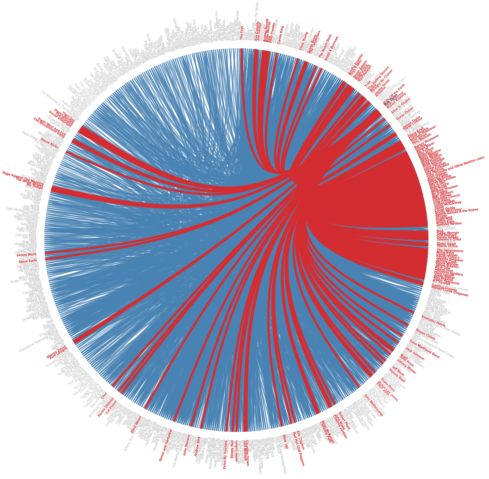
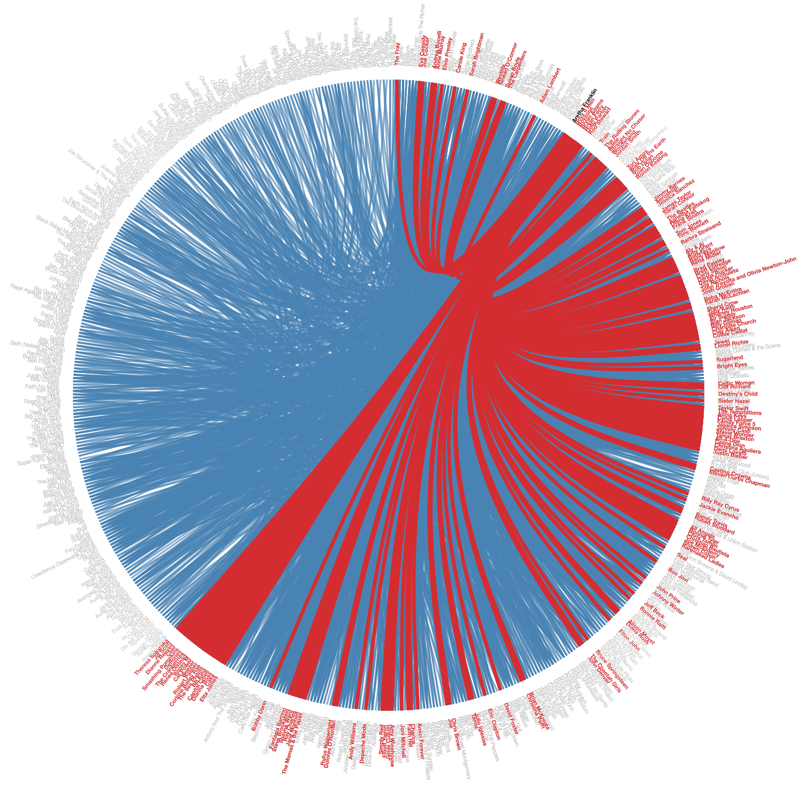
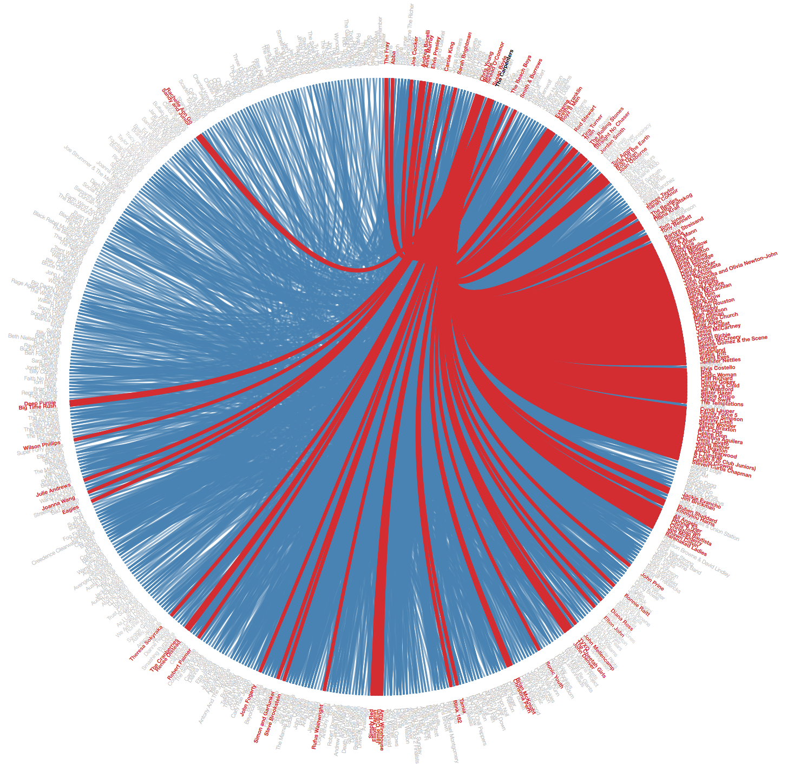

# First blog post

Do the words of a song tell us how the song relates to others songs by other artists?
Sometimes these stories are obvious. For example Kid Rock's song "All summer long" contains the line "Singing Sweet home Alabama all summer long" which is a clear reference to Lynyrd Skynyrd's classic song "Sweet home Alabama".
Other times artists cover each other (since imitation is the sincerest form of flattery), many times these covers sound comletely different yet have the same lyrics (like Hendrix's cover of Dylan's "All along the watchtower").
It also happens that multiple songs are influenced by the same event, and therefore may talk about the same thing.

Can we use text similarity measures to find songs which are related? For covers it should be easy, as the lyrics are the same, references are harder as only a small part of the lyrics maybe similar, and songs talking about the same events may be even harder.
To compound the dificulty, there are many common words in songs which are not indicative of a relationship (they are just commen words).

We would like to see how well can we find these relationships between songs, and reflect them upon the artists performing them: as example, Hendrix is connected to Dylan through "All along the watchtower". 
These connections between performers will enable us to create a "social network of performers". Such a network can have very interesting applications, such as creating a "small world" application (where we find paths connecting different artists though the words of their songs).

## Method
We plan to accomplish this task by first scraping lyrics data from azlyrics.com. We chose to use this website due to the lyrics pages being easy to parse, which will hopefully make it a simple task to scrape relatively clean data. Also songs from the website are sorted by album by artist. This means that covers are represented in the data as well as the originals, which is useful for the task we hope to accomplish. (Lastly terms of use are quite lenient, so it won't be illegal to collect the data, which is always nice.) 

After getting our data, we'll inspect it in order to understand how we need to clean the data further. This will be highly dependant upon what the data looks like once it is in our database.

To construct our "social network of performers" and find the similarities between songs based on text, we will be using unsupervised machine learning. There are multiple avenues to explore in accomplishing this. One we plan to attempt is using Kmeans clustering to create the social network. We will decide on what other methods based upon the nature of our data and database at this point. TF/IDF would also be a useful way to look at the data, as we do not want very common words to have a significant weight in whatever method we use. Additionally we could also consider not simply comparing the words of lyrics, but instead 2 grams or 3 grams in order to generate more and deeper data.

## Visualization
The final visualization will be highly dependant upon our results of the previous part. At this point hopefully we can represent our data as a graph where artists are nodes connected to each other, where the lines connecting each node has a width correlated to the strength of their relation.

If we are very ambitious we could potentially setup a simple webapp, which given one song feed the user a suggestion for another similar song or artist in our network.

# Second post

As the old adage says "no battleplan survives first contact" (Helmut von Moltke), our plan to use azlyrics.com did not survive for long, as they enforce a very agressive rate limit on page reads. Therefore we had to change our source to absolutelyrics.com (where the terms of use are for educational purposes only), which meant building a new custom scraper.

In addition since we are more careful about the rate of page requests, the rate of scraping is slow. Therefore, in order to get the amount of data (songs) we need, we are setting up a Raspberry Pi as a dedicated spider, running 24/7. In addition, we are adding proxy servers in order to be able to increase the pace of scraping.

Due to these issues we don't have enough data yet to start with perliminary exploration of the data, and testing ML algorithms.

# Third post

After some setup and debugging we managed to scrape at a pace of about 10,000 songs per day (basically scraping artists of one letter a day). This left us with an important choice: since we can't scrape the entire site (due to time constraints), we therefore must decide which groups of artists to scrape, and which not to scrape. Since the site is organized by the first letter of the artists names, this choice translates to which letters to scrape. We scraped the letters A and B as part of the scraping setup (and it includes important artists as Aretha Franklin, Aerosmith, Bob Dylan, B.B. King, and the Beatles), weprioritized scraping the additional letters (with artists we expext to have many connections): R (Rolling Stones), S (Santana, Stevie Wonder), T (Tom Petty, Tom Jones), C (The Carpenters, Carly Simon), D (David Bowie, Dolly Parton), J (Johnny Cash, Jetro Tull), and W (Willie Nelson, Whitney Houston).

All in all we scraped 99,086 songs (by ~2,200 artists). This database however, is far from perfect and has many issues: the lyrics are crowd sourced (which means that there can be spelling issues, incomplete lyrics, different formats, and other mistakes), and not every song with a lyrics page has real lyrics.

The 99,086 song contain ~160,000 unique one-grams, and ~2.9M unique two-grams. These numbers are to large to work with and therefore we decided to filter 1/2-grams that appear in only one song (and therefore can't help find similarities), and 1/2-grams that appear in more than 1,000 songs (as these are too common to be helpfull). After filtering we had a total of ~970,000 unique n-grams (while still a lot, it can be practical by using sparse matrices).

In order to find similarities we first tried computing the Jaccard similarity matrix. Suince we have ~100K songs, the matrix is of size 100K x 100K (which when storing only the upper triangle requires ~80GB of storage). When choosing only sonds with Jaccard similarity of at least 0.3 (This looked like a good value from manual exploration), we ended up with ~16K pairs of songs. We used these pairs to build a graph connecting different artists. We found that the largest connected component contained 795 artists (over a 33% of all the artists we had), which supported our original hypothesis of wide, cross genre, influences. Our final step of the project (and the next and final post) will be to use clustering as a kind of Locality Sensitive Hashing (using cosine similarity as the distance function to compute clusters).

We end this post with a few example graphs showing some very influential artists: Bob Dylan, Aretha Franklin, and The Carpenters. 

